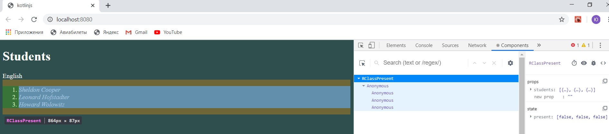
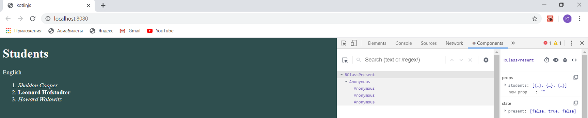

# lab5
Реализован компонент RClassPresent. В него перенесена функция override fun componentWillMount() из RStudentList, так как второй стал функциональным компонентом, а функция работает с состоянием.
Такие же действия совершены с fun onClick(index:Int). В свойства RStudentList помещен лист var onClick:List<(Event)->Unit>, что требуется для обращения к отдельным студентам. Состояние перемещено на уровень выше. 
Код для RClassPresent: 
interface RClassPresentProps : RProps {
    var students: Array\<Student>
}
interface RClassPresentState: RState{
    var present: Array\<Boolean>
}

class RClassPresent: RComponent<RClassPresentProps, RClassPresentState>() {

    override fun componentWillMount() {
        state.apply {
            present = Array(props.students.size) { false }
        }
    }

    fun onClick(index:Int): (Event) -> Unit = {
        setState {
            state.present[index] = !state.present[index]
        }
    }

    override fun RBuilder.render() {
        +"English"
        val click = props.students.mapIndexed { index, student -> onClick(index) }
            studentList(props.students, state.present, click)
    }
}
     fun RBuilder.classPresent(students: Array<Student>) =
        child(RClassPresent::class) {
            attrs.students = students
        }
После запуска:  
После того, как отметили студента присутствующим: 
